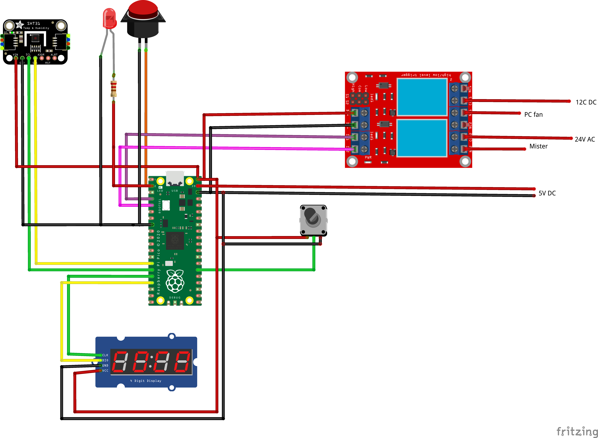

 

# Shroomifier 🍄💨

*A Humidifier for the Budding Mushroom Enthusiast*

So, you've recently found yourself mesmerized by the world of gourmet mushrooms—welcome to the club! If you're anything like me, you started innocently enough, perhaps dreaming of a shiitake or lion's mane pasta, but soon found yourself surrounded by substrate, spores, and... a tent?

Enter **Shroomifier**, a Raspberry Pi Pico-powered humidifier system designed to keep your mushroom growing tent in tip-top shape. Whether you're nurturing delicate enoki or regal king oysters, this gadget ensures your fungi friends stay cozy with perfect humidity levels.

⚠️ Heads-up: This project involves electricity and tanks full of water. If that makes you nervous, it probably should. Please only attempt if you know what you're doing. You are solely responsible for your safety and any outcomes—good or bad—that result from attempting this build.

## Features 🚀

- **Precise Humidity Control**: Powered by the SHT31 sensor, it monitors and maintains optimal humidity levels for mushroom growth.

- **Compact and Modular Design**: Built for the Raspberry Pi Pico, making it affordable and adaptable.

- **Customizable Settings**: Fine-tune your humidity thresholds with ease using the `config.json` file.

- **Real-time Display**: Includes TM1637 display support for showing live data like humidity and temperature.

- **Open-Source Goodness**: Fully hackable! Add features, tweak settings, or just marvel at the code.

## Getting Started

### Hardware Requirements

- **Raspberry Pi Pico**
- **SHT31 Humidity and Temperature Sensor** I have tried other sensors, including the DHT22, but they are buggy and will fail after a short time. They are also very inaccurate at higher humidities. The wiring diagram shows an SHT31 version that is not encased. You should opt for a weatherproof version such as [this](https://www.dfrobot.com/product-2160.html).
- **TM1637 4-Digit Display Module**
- A **pushbutton**, preferably with illumination because that looks better (the wiring diagram has the LED separate, but you can just change this to use the LED of the button).
- A **potentiometer** to dial in the target.
- A **power switch** (kinda optional but recommended); you will need to add that to your power supply.
- A 12V (or similar) **waterproof PC fan**, for example, [this one](https://www.titan-cd.com/en/product/12V-DC-IP55-Waterproof-Dustproof-Case-Cooling-Fan-120mm/TFD-12025KW-Series.html).
- A **fogger** matching the size of your tent. Any will do, but get a decent one, as it will run a lot. One option is a fogger from [House of Hydro](https://thehouseofhydro.com/) but there are many alternatives.
- A large enough **tote** depending on the size of your tent.
- A **power supply**, cables, and a mushroom tent full of potential. Keep in mind that the foggers tend to run on AC, and therefore you might need 24V AC for the fogger, 12V DC for the fan, and 5V DC for the Pi.
     - Depending on your power supply situation, a step-down module from, e.g., 12V to 5V, as well as an AC-to-DC converter from, e.g., the AC voltage of the fogger, would allow you to only use one power supply. This would make it slicker, but only do this if you are comfortable working with electrics, and remember this thing is near water; you do not want any dodgy currents anywhere nearby!


## Wiring diagram

The wiring shows an approximation of my setup. You need to make a solution for the required 2 different DC supplies and the AC supply (or whatever your fogger uses). Also use a weatherproof version of the SHT31.



## Making the fogger

To assemble the humidifier itself, watch a video, for example, [this one here](https://www.youtube.com/watch?v=vmiO6Z_HLCE). 

### Attaching it to your plumbing (optional)

If you want and are able to attach this to a tap, then this is a good idea; it makes your life easier. To do that, you need to get a float valve. I used a [spare part for the SonicAir 23L](https://hydroponics.co.uk/products/sonic-air-23l-float-kit) which you can buy separately. In theory you can also use a toilet float. Do not use the garden hose connectors, but use a washing machine hose. This will prevent leaks. 

If you go for this version, I would suggest reducing the size of your tote to a more shallow version, as the water gets refilled automatically, and this reduces the risk of stuff growing in your tank (a tiny bit).

### Software Setup

1. Clone this repository to your local machine:

   ```bash
   bash
   
   
   Copy code
   git clone <repository-url>  
   ```

2. Flash your Raspberry Pi Pico with MicroPython (if not already done).

3. Copy the following files to your Pico:

   - `main.py`
   - `sht31.py`
   - `tm1637.py`
   - `config.json`

4. Adjust the `config.json` file to your preferred humidity and temperature settings:

   ```json
   jsonCopy code{  
       "humidity_target": 85,  
       "humidity_tolerance": 5  
   }  
   ```

5. Power up your Pico, place it in your mushroom tent, and watch the magic happen!

### Pin Connections

| Raspberry Pi Pico Pin | Module        | Description |
| --------------------- | ------------- | ----------- |
| GPIO 13               | SHT31         | VCC*        |
| GPIO 15               | SHT31         | SCL         |
| GPIO 14               | SHT31         | SDA         |
| GPIO 16               | TM1637        | CLK         |
| GPIO 17               | TM1637        | DIO         |
| GPIO 5                | Relay 0       | IN          |
| GPIO 4                | Relay 1       | IN          |
| GPIO 26               | Potentiometer | SIG         |
| GPIO 1                | Pushbutton    |             |
| GPIO 2                | LED (button)  |             |

*The SHT31 is supplied with power via a pin that can be used to power the sensor down if it should fail. This has not been observed at this point so this is not implemented in the current version. 

## Usage

At start up the display flashes and if the pushbutton is pressed, the humidity target can be modified using the potentiometer. Once the humidity is modified the selection mode can be exited by pressing the button again. The display will stop flashing and the humidifier will go back into operational mode. This option is available at any time and can be reached by pressing the push button long until the display briefly goes blank and then starts flashing rapidly. 

The humidifier has a tolerance that can be adjusted in `main.py` as the variable `tolerance` this means the humidifier will only start up once the humidity is below the set tolerance under the target. 

Once the target humidity is reached the humidifier will continue for the minutes defined in `min.py` as the variable `min_overshoot`.

## Contributions

Have an idea to make this even cooler? Pull requests are welcome! Whether it's adding support for new sensors, improving the UI, or sharing your own mushroom tales, this project thrives on collaboration.

## Attribution

This project uses the following third-party modules:

- **`tm1637.py`**: MicroPython TM1637 quad 7-segment LED display driver, created by Mike Causer. Licensed under the MIT License.
  - [GitHub Repository](https://github.com/mcauser/micropython-tm1637)

- **`sht31.py`**: MicroPython SHT31 temperature and humidity sensor driver, created by Kai Fricke. Licensed under the MIT License.
  - [GitHub Repository](https://github.com/kfricke/micropython-sht31)

The MIT License details for both `tm1637.py` and `sht31.py` are included in this repository to comply with the license terms.

## License

This project is licensed under the MIT License.

------

------

Go forth and grow gourmet mushrooms with ease—and may your tent always be humid, but your spirits dry. 🌱
